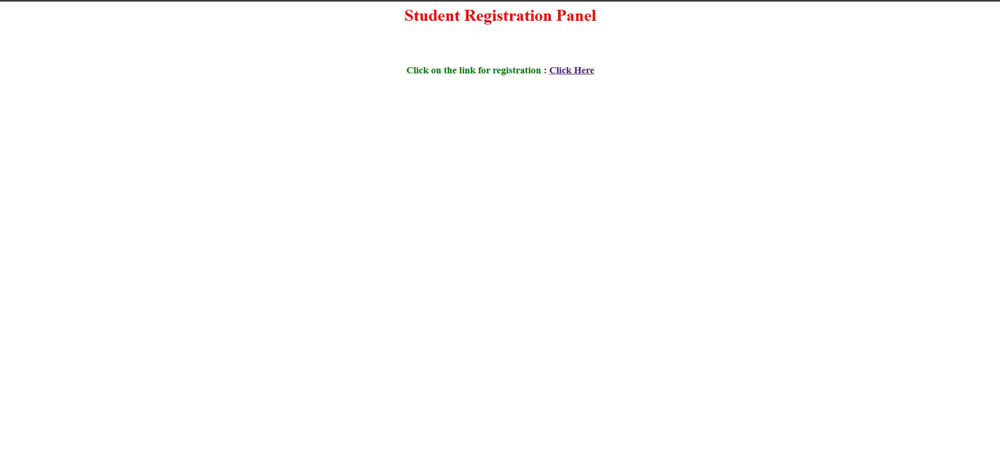
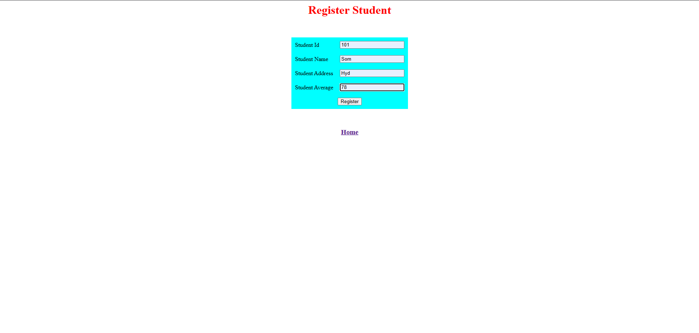
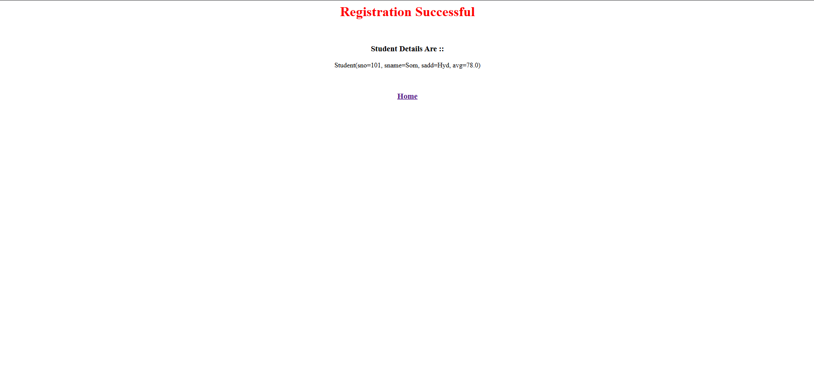

# Student Registration System (JSP & Servlet) – Learning Project

> **Learning JSP & Servlets by building a simple registration system**

This project was created while I was learning **JSP and Servlet fundamentals**.  
It focuses on understanding how form data flows from **JSP → Servlet → JSP**.

⚠️ **Note:**  
This project uses **one-way data binding** (form → model only).  
To overcome this limitation, I plan to use **Spring MVC JSP tags** in upcoming projects.

---

## Why I Built This Project

While starting Java web development, I wanted to:

- Understand how JSP and Servlets work together
- Learn how form data is handled in Java web apps
- See the request–response lifecycle in action
- Practice basic MVC architecture

This project helped me build a **strong foundation** before moving to Spring MVC.

---

## Project Objective

- Understand basics of JSP and Servlet technology  
- Learn how to handle form data  
- Understand request and response flow  
- Practice MVC (Model–View–Controller) pattern  

---

## Technologies Used

- Java  
- JSP (Java Server Pages)  
- Servlets  
- HTML  
- Apache Tomcat Server  

---

## Project Pages

### Home Page
- Displays the Student Registration panel
- Provides a link to the registration form

### Register Student Page
- Collects student details:
  - Student ID
  - Student Name
  - Student Address
  - Student Average
- Sends data to the Servlet using **POST** method

### Registration Success Page
- Displays registered student details
- Uses **JSP Expression Language (EL)** for dynamic data

---

## Screenshots

### Home Page

### Register Student Form

### Registration Success Page

---

## Application Flow

1. User opens the Home Page  
2. Clicks on the **Register** link  
3. Enters student details in the form  
4. Form data is sent to the Servlet  
5. Servlet processes the request  
6. Success page displays student details  

---

## Learning Points

From this project, I learned:

- How to create JSP pages  
- How to design HTML forms  
- How form submission works using POST method  
- Communication between JSP and Servlet  
- Using Expression Language (`${}`) for dynamic content  
- Basics of MVC architecture  
- Page navigation in Java web applications  

---

## Limitations & Improvements

### Current Limitation
- Supports only **one-way data binding**
- Manual handling of request attributes

### Planned Improvements
- Use **Spring MVC**
- Use **Spring-provided JSP form tags**
- Better validation and error handling
- Cleaner MVC separation

---

## Who This Project Is For

- Beginners learning JSP & Servlets  
- Students starting Java web development  
- Anyone who wants to understand MVC basics  

This is **not a production-ready project** — it’s a **learning project**.

---

## Final Thoughts

JSP and Servlets felt confusing at first 😅  
But building this project made the concepts much clearer.

If you’re learning:
- Start simple  
- Practice a lot  
- Don’t rush into frameworks  
- Understand the basics first  

That’s how I’m learning — step by step 🚀

---

**Built while learning by Som Gupta**

⭐ If this project helps you learn JSP & Servlets, feel free to star the repository!
